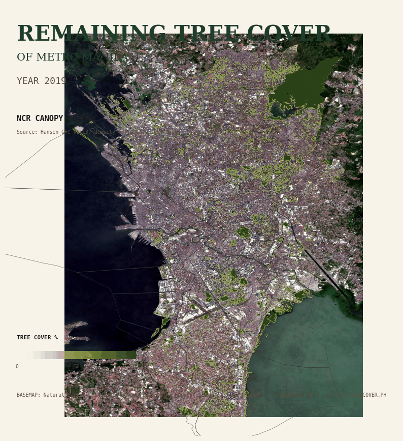

# Leaves.PH

Tree cover for Metro Manila, measured from satellite imagery. Annual per-LGU values from 2019 to 2026 for the 17 LGUs of the National Capital Region (16 cities plus the municipality of Pateros). Inputs, method, and outputs are open and reproducible from a clean clone.

[](LICENSE)
[](https://www.python.org/downloads/)
[](README.md)



Live site: [leaves.ph](https://leaves.ph).

## What it measures

For each year, what fraction of each LGU's area reads as tree canopy. The published figures come from a **human-calibrated canopy model** trained on manual high-resolution labels (it still carries a known grass/scrub margin, so read it as a tree-canopy estimate, not a pixel-exact census).

1. **Human-calibrated canopy model (published).** A gradient-boosted classifier over ten per-pixel features (NDVI, Dynamic-World tree probability, Meta v2 1m canopy height, ESA tree class, and raw Sentinel-2 spectral bands), trained on **656 manually labeled high-resolution pixels** (active learning plus a 500-pixel random round). Its 10 features are NDVI, Dynamic-World tree probability, Meta v2 1m canopy height, the ESA tree class, and the raw Sentinel-2 spectral bands (red/nir/green/blue + GNDVI). Against those human labels it scores **F1 0.78 / IoU 0.64** (precision 0.77, recall 0.79), beating the old **NDVI > 0.62 baseline** (F1 0.68 / IoU 0.52), kept only for comparison. The map, the per-LGU and per-barangay series, and the headline number all come from this model. It holds a steady 9–10% NCR snapshot (threshold calibrated to the 10.1% human-truth canopy), removing the year-to-year sawtooth the NDVI threshold produced. The spectral bands lifted F1 from 0.75 (four-feature) to 0.78 by rejecting grass; a CLIP ViT-L/14 embedding was tested and did not help. Method and gold labels: [`BENCHMARKS.md`](BENCHMARKS.md), `tmp/labeling-20260529T073613Z/`; deployed by [`pipeline/compute_canopy_model.py`](pipeline/compute_canopy_model.py).
2. **CLIP detection model (separate research track).** A CLIP ViT-Large/14 embedding per 240m tile feeding a gradient-boosted regression head that predicts canopy fraction in [0, 1], trained on Meta's 1m canopy fraction the same way [SolarMap.PH](https://github.com/xmpuspus/solar-map-ph) was built. On held-out locations it reaches R² 0.83–0.86 under grouped 5-fold cross-validation (0.86 location-grouped, 0.83 spatial-block; MAE 0.053, n = 38,260 tiles) against Meta AI Global Canopy Height v2 at canopy > 5m. That R² measures how well it reproduces Meta's 1m canopy fraction — its calibration target — not accuracy against independent ground truth. It is in optimization and is not the source of any published figure.

Headline number: NCR area-weighted canopy is **~9–10%** from the published model (2026 reads 8.82% but is provisional, Jan-May imagery only; the threshold is calibrated to the 10.1% human-truth canopy). Read the per-year values as annual cross-sectional snapshots, not a change series.

| LGU | 2026 canopy % (model) | 2019 → 2026 Δ (pp) |
|---|---|---|
| Quezon City | 22.10 | −0.22 |
| Caloocan | 14.36 | −1.42 |
| Makati | 12.22 | +1.77 |
| Mandaluyong | 10.36 | +0.73 |
| Marikina | 7.96 | −0.32 |
| ... | ... | ... |
| Manila | 1.37 | +0.23 |
| Navotas | 0.30 | −0.24 |

Full series, per-LGU table, detection-model accuracy, and adjacent published estimates: [`BENCHMARKS.md`](BENCHMARKS.md).

## What you can do with it

- Read the per-LGU canopy series for all 17 NCR LGUs at [`data/per_lgu/per_lgu_canopy_2019_2026.csv`](data/per_lgu/per_lgu_canopy_2019_2026.csv). The CSV is hash-pinned; `make hash-verify` confirms a clean reproduction.
- Browse the interactive map at [leaves.ph/map](https://leaves.ph/map). It carries an OSM/satellite basemap, a 1m Meta canopy raster overlay, 242,810 individual tree-crown polygons (connected components of Meta's 1m canopy-height mask) coloured by source (OSM-confirmed / tall canopy / candidate), and a year slider.
- Inspect any tree crown: click a crown polygon and the popup shows an Esri aerial of that exact location plus the polygon's metadata (status, area, p50/p95 height).
- Re-run the pipeline on a different city. The Cebu City proof in `pipeline/fetch_cebu_proof.py` shows the same pipeline run end-to-end against a different bbox, with no NCR-specific retraining.

## What it is not

- Not a competing global forest model. Uses Hansen GFC, ESA WorldCover, Dynamic World, and Meta Canopy Height verbatim and stacks them.
- Not a per-tree census. A 30m Sentinel-2 pixel can contain a few small trees or none; the per-crown polygons in `tree_crowns_ncr_tagged.pmtiles` are derived from a 5m-tall canopy mask, not from individual tree detections.
- Not a permit-compliance tool. The pipeline computes canopy fractions from public-record satellite imagery. Specific allegations of unpermitted cutting require independent investigation.
- Not a measurement of every tree. Sub-pixel canopy (street trees in a building shadow, hedges, recently-planted seedlings) sits below the model's resolution floor.

## Adjacent published estimates

Listed for methodology context, not as a ranking. Definitions differ across sources (canopy fraction vs closed-canopy area, % vs hectares, single-epoch vs multi-year baseline).

| Source | Year | Method | NCR canopy |
|---|---|---|---|
| Meta v2 (canopy height > 5m) | 2018-2020 | 1m AI canopy-height regression | 7.5% |
| ESA WorldCover v200 (class 10) | 2021 | 10m land-cover classification | 13.38% |
| DENR FMB (cited in news / EJN) | 2024+ | not specified in public docs found | 6.0% |
| Global Forest Watch dashboard PHL/47 | 2020 baseline | Hansen 30m tree-cover ≥ 30% canopy | 4.0% |
| Earth Journalism Network | 2020 | DENR "open forest" sub-class | 2,071 ha |
| ScienceKonek 2024 map | 2024 | raster + methodology not publicly findable | unknown |

## Reproduce locally

Requires Python 3.11+, ~2 GB of disk for cached composites, and one-time Google Earth Engine + AWS-Open-Data authentication.

```bash
git clone https://github.com/xmpuspus/leaves-ph
cd leaves-ph
python3 -m venv .venv && source .venv/bin/activate
pip install -r requirements.txt
earthengine authenticate     # one-time browser flow

make fetch                   # pull S2 + Hansen + ESA + Dynamic World + Meta (~30 min, network)
make compute                 # per-LGU canopy series 2019-2026 from cached composites
make calibrate               # tune the NDVI threshold against Meta canopy height
make train                   # train the CLIP + gradient-boosted detection model (optional, ~30 min on M-series GPU)
make scan                    # multi-year density rasters + per-LGU + per-barangay CSVs
make verify                  # 27-check release gate (must return all PASS)
make hash                    # sha256 prefix of the canonical per-LGU CSV
```

If the GEE pull is skipped, `make compute` reads cached composites from `data/composites/`. The 17 LGU canopy curves drop into `data/per_lgu/per_lgu_canopy_2019_2026.csv` and the static site reads from `site/public/data/per_lgu_canopy.geojson`.

## Methodology

Full version: [`docs/methodology.md`](docs/methodology.md). [`MODEL_CARD.md`](MODEL_CARD.md) documents intended use, known biases, and the detection model. [`BENCHMARKS.md`](BENCHMARKS.md) carries the held-out accuracy, MAE, per-bin residual, per-LGU table, and multi-year scan result.

Short version: pull annual Sentinel-2 L2A median composites over the NCR bbox, mask clouds with s2cloudless, compute NDVI, threshold at a value calibrated against Meta v2. The published per-LGU and per-barangay series come from this baseline. Separately, the detection model (CLIP ViT-Large/14 embeddings feeding a gradient-boosted regression head, trained per the SolarMap pattern onto Meta's 1m canopy fraction) is in optimization toward a first release. Aggregate per LGU and per barangay from PSA / OSM admin boundaries.

## Data products

Published under `site/public/data/` and `data/per_lgu/` (CC-BY-4.0):

| File | Schema | Notes |
|---|---|---|
| `data/per_lgu/per_lgu_canopy_2019_2026.csv` | (lgu_name, year, canopy_ha, canopy_pct, total_ha) | 17 × 8 = 136 rows; hash-pinned |
| `site/public/data/per_lgu_canopy.geojson` | one feature per LGU; props = canopy_<year>_pct + canopy_<year>_ha | derived from the CSV |
| `data/per_barangay/per_barangay_canopy_2019_2026.csv` | (barangay, lgu_name, canopy_pct_<year> × 8, canopy_ha × 8) | 892 OSM admin-level=10 polygons inside NCR |
| `site/public/data/tree_crowns_ncr_tagged.pmtiles` | 242,810 crown polygons (connected components of Meta's 1m canopy-height mask); status ∈ {confirmed, new, candidate} | the map's vector layer |
| `detection/scan/*_density_<year>.tif` | continuous canopy density 0..1 per pixel from the detection model | one per year 2019-2026 |
| `site/public/validation/*.png` | per-LGU visual validation panels | 17 panels comparing baseline vs detection model |

## Roadmap

- Per-barangay extension shipped at 892 OSM polygons; mapping them onto the PSA barangay roster is the next data-engineering step.
- Cebu City proof shipped (`pipeline/fetch_cebu_proof.py`, `detection/scan/scan_cebu.py`). Davao, Iloilo, Cagayan de Oro are the next regional rollouts.
- S2 10m chunked exports for a precision lift on the detection model over the same 240m physical window.
- GEDI L2A monthly RH98 spot truth for per-epoch calibration (currently the NDVI threshold is calibrated to a single ~2019 Meta-derived truth and applied uniformly).

## License and attribution

Code: MIT (see [`LICENSE`](LICENSE)). Data products: CC-BY-4.0.

Attribution when redistributing the data: *Leaves.PH (2026), Sentinel-2 2019-2026 (2026 provisional), https://github.com/xmpuspus/leaves-ph*.

Required upstream attribution line:
*Imagery contains modified Copernicus Sentinel data 2019-2026 processed by ESA. Tree-cover-loss layer: Hansen et al. 2013 via Global Forest Watch. Land cover: ESA WorldCover v200 (CC-BY-4.0) and Google Dynamic World v1. Canopy height: Meta AI / Land & Carbon Lab Global Canopy Height v2 (CC-BY-4.0). Administrative boundaries: OpenStreetMap contributors and Philippine Statistics Authority.*

## Citation

```bibtex
@software{puspus_leaves_ph_2026,
  author = {Puspus, Xavier},
  title  = {{Leaves.PH: an open-source tree-cover measurement series for Metro Manila}},
  year   = {2026},
  url    = {https://github.com/xmpuspus/leaves-ph}
}
```

[`CITATION.cff`](CITATION.cff) is the machine-readable form. A versioned Zenodo DOI is minted at each tagged release.

## Public-record disclaimer

All inputs are public-record satellite imagery and public administrative boundaries. The pipeline computes per-LGU and per-barangay canopy fractions from canonical global datasets. Specific allegations of unpermitted tree cutting, if any, require independent investigation and corroboration. Vegetation visible from public-domain satellites is not personal data under Republic Act 10173.

## Contact and corrections

LGU value corrections, missing barangays, methodological questions: open a GitHub issue at https://github.com/xmpuspus/leaves-ph/issues.

If you believe a published artefact identifies a specific private individual or violates RA 10173, file a private advisory at https://github.com/xmpuspus/leaves-ph/security/advisories/new. Acknowledged within 5 working days.
